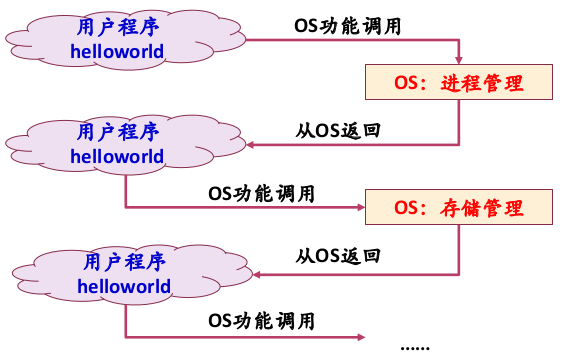

# 操作系统原理

> 北大    陈向群老师

## 操作系统概述

### 操作系统做了什么

以 C 语言 `puts("Hello World!")` 程序为例。

1. 有不同的方式告知运行程序

2. 根据用户行为获得程序文件路径，根据路径查找相应文件。检查该文件是否是可执行文件。根据程序首部信息确定代码、数据在文件中的位置并计算出相应磁盘块地址。

   Windows 可执行文件：PE 格式；Linux：ELF 格式。TODO

3. 创建新进程，将可执行文件格式映射到该进程结构，控制权给调度程序。设置 CPU 上下文环境，跳转到程序开始处。

4. 运行第一条指令，进程发生**缺页异常**。因为此时程序不在内存中。

5. 控制权返回操作系统，将程序从磁盘读入内存。若程序较大，将**多次发生缺页异常**。

6. 执行程序，`puts` 属于系统调用，控制权返回操作系统，将字符串传递给显示设备。

7. 显示设备由进程控制，之后硬件进行动作

用户视角

OS 视角

### 操作系统定义与作用

操作系统是一个系统**软件**，是一些程序模块的集合。 

- 有效：系统效率，资源利用率。设备，内存，磁盘。忙碌
- 合理：资源管理的公平合理。
- 方便使用：UI、API

**作用**

- 资源的管理者（自底向上）：硬件资源和软件资源

  - 跟踪记录资源的使用状况——数据结构：是否空闲、分配给了谁、TTL 等
  - 资源分配策略——算法
    - 静态分配策略
    - 动态分配策略
  - 资源的分配与回收
  - 提高资源利用率
  - 保护资源的使用
  - 协调多个进程对资源请求的重读

  **五大基本功能**

  - 进程/线程管理（CPU 管理）
  - 存储管理
  - 文件管理
  - 设备管理
  - 用户接口：系统命令、编程接口

- 系统服务的提供者

  - 命令、系统调用（UI、API）
  - 典型服务：进程的创建与执行、文件和目录操作、I/O 设备使用等

- 对硬件机器的扩展

  - 硬件 -> 操作系统 -> 应用程序。

  - 用户不需要直接管理硬件

    与硬件相关的工作复杂而繁琐。对硬件进行抽象，提高可移植性。

### 操作系统的主要特征

**特征：**并发、共享、虚拟、随机

- 并发（concurrency）：处理多个同时性活动，多任务。

  活动间的切换、保护、同步。单 CPU(单核) 轮流执行，多核为多个 CPU 单元。

  并行（parallel）：不同程序同时在多个硬件部件上执行

- 共享（sharing）：OS 与多个 APP 共享有限的系统资源

  资源分配，资源交替地被使用

  互斥共享（打印机）、同时共享（磁盘文件，可同时打开同一磁盘上的文件）

  > 分配最优化、保护资源

- 虚拟（virtual）：将一个物理实体映射为多个逻辑实体——分时、分空间

  提高资源利用率

  【例】CPU 轮流执行进程；存储器的虚拟地址空间；多窗口、多终端

- 随机：随时对以*不可预测的次序*发生的时间进行相应并处理

  进程运行速度无法预知；难以重现系统状态

### 典型操作系统的架构

层次架构基本相同，但内核结构不同

**Windows**

硬件 -> 内核态 -> 用户态

不同系统区别主要在*内核态*，不同硬件区别主要在 *HAL*。

硬件 -> 操作系统 -> 系统功能调用 -> 应用程序

**UNIX**

硬件 -> 内核 -> 系统调用 -> 用户程序

用户能够直接进行系统调用，也可以通过函数库

**Linux**

内核态、用户态

**Android**

*Linux 内核* -> 系统库和 Android 运行时 -> 应用程序框架 -> APP

**思考题**

1.  前三个系统架构图对比结论
2.  从 Android 架构图得到的结论

### 操作系统分类

根据历史发展分类系统。

主要掌握：各种系统的主要目标、工作方式

打印过程采用：SPOOLing 技术，纸未打印完就可以关闭文档。

## 操作系统运行环境与运行机制

操作系统是硬件基础上的第一层拓展

*   运行环境
    *   CPU 状态
    *   中断/异常机制
*   运行机制
    *   系统调用

### 处理器状态（模式）

控制和状态寄存器

+ PC：程序计数器（Program Counter）
+ IR：指令寄存器（Instruction Register）
+ PSW：程序状态字（Program Status Word）

PPT p8

硬件需要提供基本运行机制

*   特权级别，分成不同的指令集合
*   隔离 OS 与用户程序

操作系统需要 2 种 CPU 状态，PSW 中设置 1~2 位

*   内核态：特权（privilege）指令、非特权指令
*   用户态：非特权指令

状态转换

* 用户态 到 内核态：**中断、异常、陷入机制（访管指令）**

  > 内核态也称 supervisor mode，访问管理状态

  int, trap, syscall, sysenter/sysexit

* 内核态 到 用户态：设置 PSW

### 中断与异常机制介绍

> 操作系统是由 中断/事件 驱动的！

中断（外中断）：外部设备向 CPU 汇报结果的工具，操作系统被动处理

异常（内中断）：执行时代码出错、陷入指令等，操作系统主动处理

事件类型

中断——异步

异常（包括 陷入、故障、终止）——同步

>   思考：同步、异步、阻塞、非阻塞
>
>   https://github.com/calidion/calidion.github.io/issues/40

### 中断与异常机制原理

**硬件**

响应：发现中断、接收中断

执行完一条指令后，CPU 才扫描中断寄存器，**轮询**！查找中断向量表（软硬件结合，因为需要先有处理程序，才能有程序的入口地址）。中断向量：入口地址、PSW。

*处理器状态被切换到内核态*

**软件**

中断处理程序。设计操作系统时就编写好。OS 初始化时，设置相应的中断向量表。

**实例：**x86 机制

《计原》中的中断学习

中断描述符表->门描述符：任务门、**中断门**、**陷阱门**、调用门。

中断描述符表结构：

特权级检查！

中断流程：

### 系统调用机制

操作系统向用户提供的接口，操作系统功能调用。内核函数->系统调用->库函数/API

系统调用：`int 0x80 (中断号 128)`

使 CPU 从用户态陷入内核态

参数传递：不允许数据从用户栈推送到内核栈，一般使用通用寄存器传递参数。

初始化系统调用门描述符：`set_system_gate(0x80, &system_call);`

门类型：15，陷阱门；DPL：3，与用户级别相同，允许用户使用。

## 进程线程模型

### 进程的基本概念

多道程序设计：允许多个程序**同时**进入内存并运行，提高系统效率。

并发环境：多个程序**同时**处于运行但未结束的状态，次序不确定。并发程序：在并发环境中执行的程序。

进程（process，对 CPU 的抽象）：具有独立功能的程序关于*某个数据集合*上的*一次运行活动*，是系统进行资源分配和*调度*的独立单位。又称任务（task, job）。具有独立的**地址空间**。

PCB（Process Control Block）：进程描述符、进程属性。管理控制进程的数据结构，是系统感知进程存在的唯一标识。进程表：所有进程的 PCB 集合，大小一般是固定的，因操作系统而异。

+ 进程描述信息：进程标识符（ID）、进程名、用户标识符、进程组关系
+ 进程描述信息：
+ 拥有的资源和使用情况
+ CPU 现场信息：寄存器值、只想进程页表的指针

Linux: task_struct; Windows: EPROCESS, KPROCESS, PEB

### 进程状态及状态转换

三种基本状态：运行态、就绪态、等待态（running, ready, waiting/blocked）

其他状态：创建（由于资源有限而未被允许执行）、终止（完成数据统计工作；资源回收）、挂起（用于调节负载；进程不占用内存空间，进程映像交换到磁盘上；激活）

5 状态模型：创建、就绪、阻塞、运行、终止

7 状态模型：就绪挂起、阻塞挂起

进程队列：运行队列、就绪队列、多个等待队列（以等待时间划分）。进程状态的改变 = PCB 从一个队列转移到另一个队列。单 CPU 情况下，运行队列中只有一个进程。

### 进程控制

**原语 (primitive)：**原子操作 (atomic)，。屏蔽中断。

进程控制操作由具有特定功能的原语完成：

+ 进程创建
+ 进程撤销
+ 进程阻塞
+ UNIX 几个进程控制操作 (以系统调用的形式)
  + fork: 
  + exec: 
  + wait: 
  + exit: 

### 关于进程相关概念的讨论

进程分类

+ 系统进程、用户进程
+ 前台进程、后台进程
+ CPU 密集型进程、I/O 密集型进程

进程层次结构：UNIX 进程家族树，init 为根 (1 号)，进程结束则子进程必须结束；Windows 地位相同

进程与程序的区别

进程地址空间：程序中使用的地址是相对地址（逻辑地址、虚拟地址）。

进程映像 (image)：对进程执行活动全过程的静态描述。Todo: 补充

上下文 (context) 切换：CPU 硬件状态从一个进程换到另一个进程的过程

### 线程的引入

+ 应用的需要：UI 交互、Web 服务进程
+ 开销的考虑：创建、切换、通信
+ 性能的考虑：多个处理器

进程的基本属性：资源的拥有者、CPU 调度单位

线程的基本概念：进程中的一个运行实体，线程成为 CPU 调度单位。

线程属性

+ 标识符 ID
+ 状态及状态转换
+ 不运行时需要保存的上下文
+ 自己的栈和栈指针！
+ 共享所在进程的地址空间和其他资源
+ 可以创建、撤销另一个线程；程序一单线程进程方式开始

### 线程机制的实现

1. 用户级线程
   + 运行时系统：完成线程的管理工作
   + 内核不知道线程
   + 线程切换不需要内核态权限
   + UNIX，POSIX 线程库 (pthread)
     + pthread_yield: 线程资源让出 CPU
   + 优缺点
2. 内核级线程
   + 内核维护进程和线程的上下文
   + 线程切换需要内核支持
   + Windows
3. 混合模型
   + 用户控件进行线程创建
   + 核心态进行线程调度

### 总结

+ 进程：并发性、动态性、独立性、交互性、异步性、进程映像
+ 线程：线程实现机制

可再入程序（可重入）：可被多个进程同时调用的程序；必须是纯代码的，在执行过程中自身不改变，并且调用它的进程应该提供数据区。

## 处理器调度

## 同步机制 (1)

## 同步机制 (2)

## 存储模型 (1)

## 存储模型 (2)

## 文件系统 (1)

## 文件系统 (2)

## I/O 系统

## 死锁

